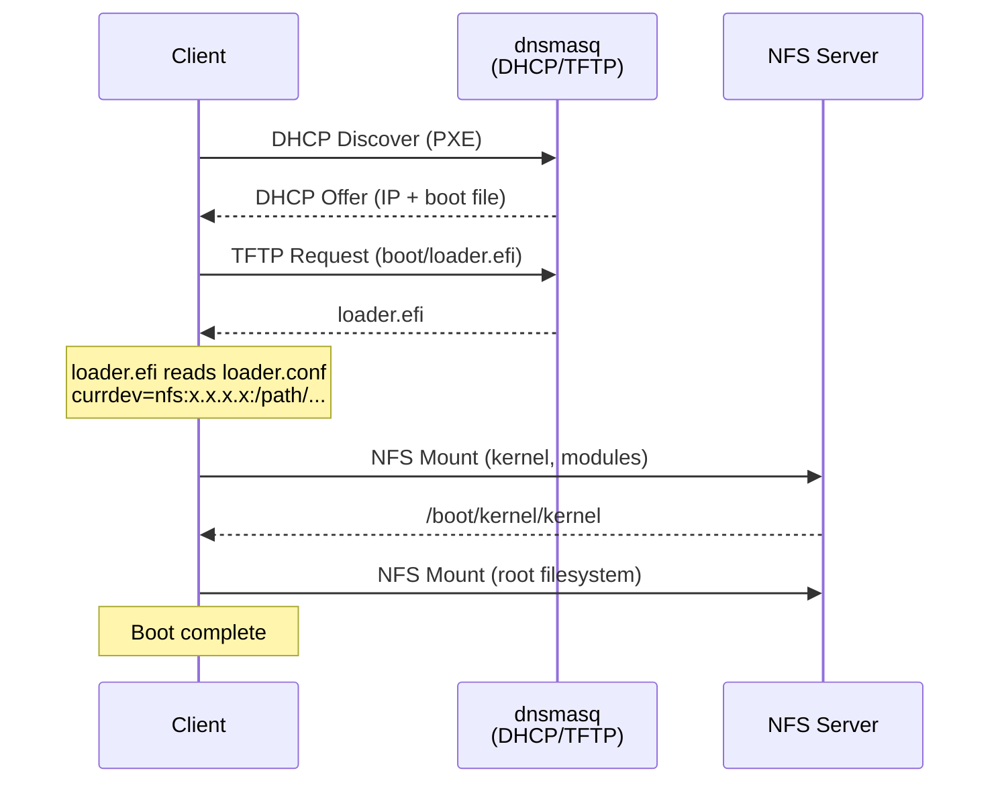

# FreeBSD PXE Boot Server Ansible Playbook

Ansible playbook for setting up a FreeBSD PXE boot server.

## Overview

- **Boot method**: FreeBSD native (pxeboot/loader.efi) + NFS root
- **DHCP mode**: Authoritative DHCP (dedicated network segment)
- **NFS version**: NFSv3
- **Supported architectures**: BIOS Legacy / UEFI (including KVM/OVMF)

## Role Responsibilities and Dependencies

| Role                | Responsibility                                       | Depends on   |
|---------------------|------------------------------------------------------|--------------|
| `dnsmasq`           | Package installation                                 | None         |
| `dnsmasq_conf`      | DHCP/TFTP/PXE configuration                          | dnsmasq      |
| `nfs_server`        | rc.conf.d (service enablement)                       | None         |
| `nfs_server_conf`   | /etc/exports configuration + service startup         | nfs_server   |
| `freebsd_root`      | NFS root directory creation + base/kernel extraction | None         |
| `freebsd_root_conf` | loader.conf configuration                            | freebsd_root |
| `pxeboot_conf`      | TFTP directory creation + bootloader deployment      | freebsd_root |

## Boot Sequence

## Design Principles

- **Roles without `_conf` suffix**: Create the existence of something (package installation, service enablement, material preparation)
- **Roles with `_conf` suffix**: Configure existing resources (configuration file deployment)
- **rc.conf.d separation**: Place service configurations in `/etc/rc.conf.d/<service>` instead of editing `/etc/rc.conf` directly
- **conf.d pattern**: Separate configuration files by function (numbered for ordering)
- **files/ vs templates/**: Static files in files/, variable interpolation in templates/
- **Role dependencies**: Define inter-role dependencies via meta/main.yml
- **Idempotency via handlers**: Restart services only when configuration changes

## loader.conf Settings

| Setting                 | Purpose                                                               |
|-------------------------|-----------------------------------------------------------------------|
| `currdev`               | Device from which loader reads the kernel (switches from TFTP to NFS) |
| `vfs.root.mountfrom`    | Device to mount as root after kernel startup                          |
| `vfs.mountroot.timeout` | Mount timeout in seconds                                              |

## License

This project is licensed under the [MIT License](./LICENSE).
